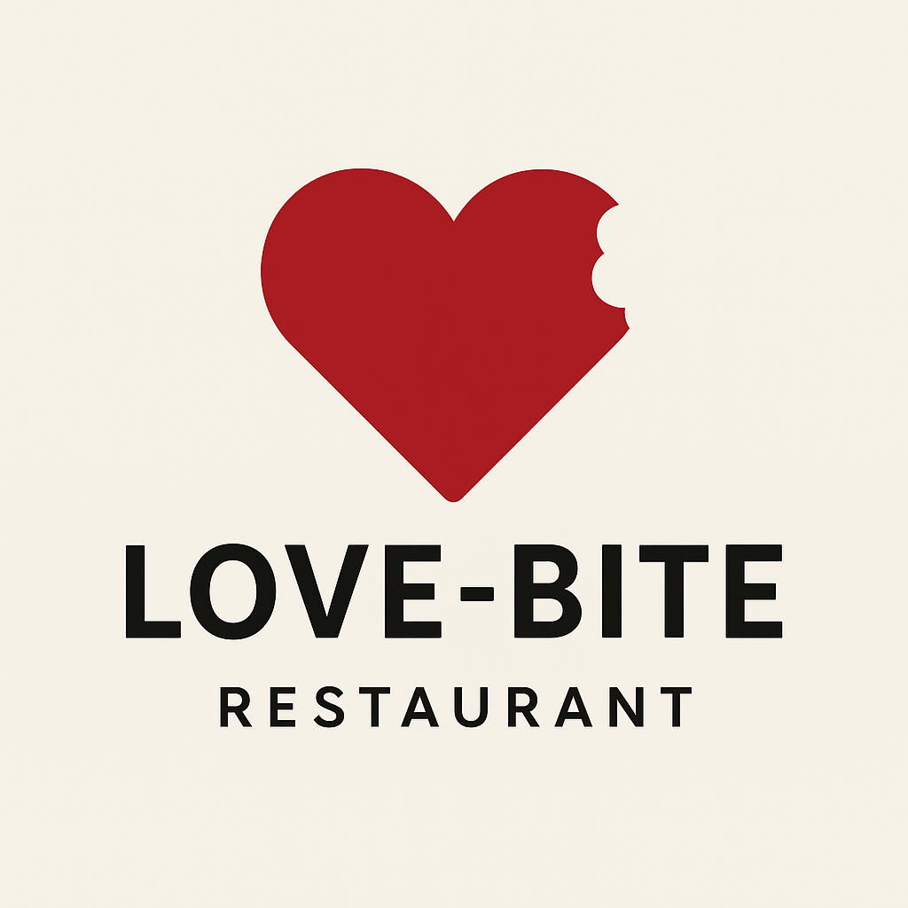
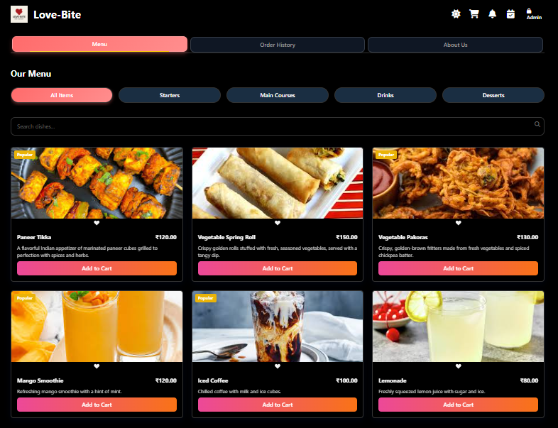

# 🍽️ Love-Bite Restaurant - Ordering System

A modern, full-stack restaurant ordering system with UPI payment integration, email receipts, table management, and an admin dashboard.



---
## 🎬 Preview & Live Demo

### 📱 Screenshots

| Customer Interface | Admin Dashboard | Payment QR |
|---|---|---|
|  |  |  |


## ✨ Features

### Customer Features
- 🍜 **Dynamic Menu** - Browse categories (Starters, Main Courses, Drinks, Desserts)
- 🛒 **Shopping Cart** - Add/remove items with real-time price updates
- 💳 **UPI Payment** - QR code-based payment system with dynamic amounts
- 📧 **Email Receipts** - Automatic order confirmation via email
- 📱 **Responsive Design** - Works on desktop, tablet, and mobile
- 🌙 **Dark Mode** - Toggle between light and dark themes
- 📍 **Table Allocation** - Book and track table reservations
- 📜 **Order History** - View past orders and details
- 🔍 **Search & Filter** - Find dishes by name or category

### Admin Features
- 🔐 **Admin Dashboard** - Manage orders and operations
- 📊 **Real-Time Updates** - Socket.IO integration for live order tracking
- 📋 **Order Management** - View, update, and clear orders
- 🪑 **Table Management** - Manage table allocations and availability
- 📅 **Booking Management** - Handle restaurant reservations
- 📊 **Analytics** - Track orders and bookings

### Technical Features
- ✅ **Tax Calculation** - Automatic 2% tax on all orders
- 🔐 **Secure Admin Login** - Password-protected admin panel
- 💾 **Data Persistence** - Orders saved to JSON files (MongoDB optional)
- 🔄 **Real-Time Sync** - Socket.IO for live updates across clients
- ⚡ **Rate Limiting** - API protection against abuse

---

## 🛠️ Tech Stack

### Frontend
- **HTML5** - Semantic markup
- **CSS3 & Tailwind CSS** - Responsive styling
- **JavaScript (Vanilla)** - Dynamic functionality
- **QRCode.js** - UPI QR code generation
- **Font Awesome** - Icons

### Backend
- **Node.js** - Runtime environment
- **Express.js** - Web framework
- **Socket.IO** - Real-time communication
- **Nodemailer** - Email delivery
- **fs-extra** - File operations
- **dotenv** - Environment configuration
- **bcrypt** - Password hashing
- **express-rate-limit** - API rate limiting
- 
---

## 👨‍💼 Admin Features

### Access Admin Panel
1. Click "Admin" button in top-right corner

### Admin Dashboard Tasks
- ✅ View real-time orders
- ✅ Assign tables to orders
- ✅ Manage bookings
- ✅ View table availability
- ✅ Clear orders/bookings
- ✅ Monitor order status

---

## 💳 Payment System

### UPI Payment Flow
1. Add items to cart
2. Enter email address (required for receipt)
3. Click "Proceed to Payment"
4. Scan QR code with UPI app (Google Pay, PhonePe, etc.)
5. Confirm payment
6. Receive email receipt automatically


```

## 📧 Email & Receipt Configuration

### Email Receipt Contents
- Order ID & confirmation
- Order date & time
- Items ordered (with quantities)
- Subtotal calculation
- Tax (2%)
- Service fee
- Final total

### Test Email Receipt
1. Place trial order with email
2. Check inbox or spam folder
3. Look for "Order Confirmation - Love-Bite Restaurant"

### Troubleshooting Email
- **"SMTP not configured"**: Add credentials to `.env`
- **Email not arriving**: Check spam folder or verify credentials
- **Gmail error**: Use App Password (not main password)

---

## 🛡️ Security Features

- ✅ Password hashing with bcrypt
- ✅ Rate limiting on API endpoints
- ✅ CORS protection
- ✅ Environment variable isolation
- ✅ Secure email credentials storage

---

## 📊 Default Menu

The menu includes:
- **Starters**: Samosa, Paneer Tikka, Garlic Bread, etc.
- **Main Courses**: Biryani, Butter Curry, Gobi Manchurian, etc.
- **Drinks**: Mango Lassi, Coca Cola, Beer, etc.
- **Desserts**: Gulab Jamun, Kheer, Brownie, etc.

All items include:
- Name
- Category
- Price (₹)
- Description
- Image URL

---


## 🔄 Data Files

### orders.json
Stores all customer orders with:
- Order ID
- Items & quantities
- Pricing (subtotal, tax, total)
- Customer email/phone
- Table number
- Timestamp

### bookings.json
Stores table reservations with:
- Booking ID
- Customer name & contact
- Date & time
- Party size
- Status

### tables.json
Stores table information:
- Table number
- Capacity
- Status (available/occupied)
- Allocated order ID

---

## 📞 Support & Contact

- **Restaurant**: lovebiterestaurant89@gmail.com
- **Developer**: Shreyas Kulkarni
- **Year Established**: 2026

---

## ⚖️ Legal

- [Terms & Conditions](legal/Terms.html)
- [Privacy Policy](legal/privacy.html)
- [Security Policy](legal/security.html)

---

## 📄 License

© 2026 Love-Bite Restaurant. All rights reserved.

---

## 🎯 Future Enhancements

- [ ] Mobile app (React Native)
- [ ] Payment gateway integration (Razorpay, Stripe)
- [ ] Advanced analytics dashboard
- [ ] Loyalty program
- [ ] Multi-language support
- [ ] Customer reviews & ratings
- [ ] Delivery tracking
- [ ] Staff management system

---

## 🤝 Contributing

For bugs or suggestions, contact the development team.

---
BY SHREYAS KULKARNI
**Last Updated**: April 14, 2026  
**Version**: 1.0.0  
**Status**: Production Ready ✅

